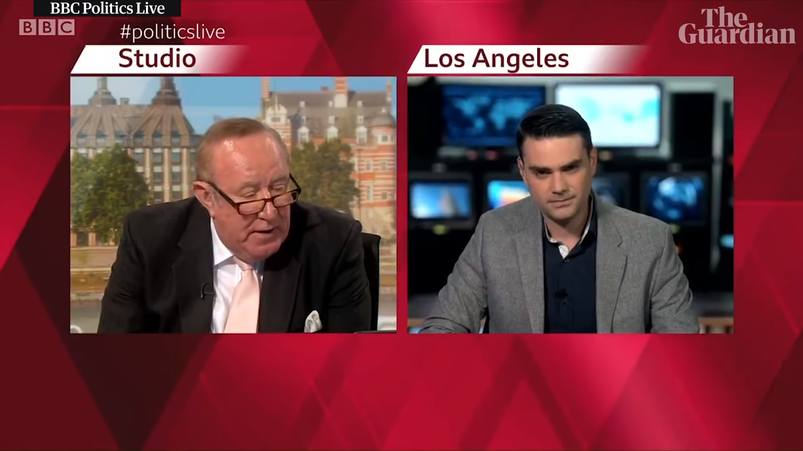

There’s a clip going viral on the internet involving Ben Shapiro in a heated argument with a ‘Leftist’. That word is stressed in single quotes because Ben Shapiro referred to Andrew Neil, the former chairman of the Federation of Conservative Students, a Leftist. Oh Boy!

Ben Shapiro, the editor of the Daily Wire, was called into a BBC studio in America for an Interview. Andrew Neil questioned Shapiro about his book, which explains the current political discourse in America and how it is full of anger. During the interview, Andrew compared Shapiro’s past racially insensitive tweets and political bias towards the left, which made Shapiro lose his temper. Shapiro ended up embarrassing himself as the interview finished.

Frankly speaking, I am no fan of Andrew Neils. I don’t believe in preaching to the Authority as it hinders one’s objectivity. Surprisingly, Shapiro’s objectivity was the only thing that was tested during his interview with the Leftist Andrew Neil.

“I am interested that you think there’s a thought movement inside the Republican party, I mean half of the conservatives have run out of ideas in America. All the new policies, Medicare for all, $15 minimum wage the Green new deal, they’re all coming from the left and they’re all popular.”

Shapiro replied to this question by saying that “We have a strong debate that goes inside the conservative hall of intelligencia”, which is just a made up word. Shapiro couldn’t find any of the “conservative-ideas” that was discussed in that hall, to support his answer. And neither could I after hours of Google Search.

“Some of the ideas that are popular on your side with politics would seem to take us back to the dark ages. Georgia’s new abortion law, which you’re very much in favour of, is that a woman who miscarries could get 30 years. A Georgian woman who travels to another state for an abortion procedure could get 10 years. These are extreme hard policies”

Asked Andrew Neil.

“Are you an Objective Journalist or an Opinion journalist?”, Shapiro inquired.

“I am a Journalist that asks question” answered Andrew. Unlike Shapiro, who then went on to label Neil of showcasing bias towards one side of the political aisle. In this case of the left.

Andrew put these allegations from Shapiro to rest by saying, “My job is to question those who have strong views and put an alternative to them. If you were an anti-abortion person, I would be putting pro-abortion questions to you”

“So why don’t you just answer my question”

Which Shapiro did by saying that “human life exists at inception, it ought to be protected” and seemingly hurried back to his position to label the BBC and Andrew Neil as a leftist organization.

<!--  -->

<iframe width="560" height="315" src="https://www.youtube.com/embed/PRF3r3zUGqk" frameborder="0" allow="accelerometer; autoplay; encrypted-media; gyroscope; picture-in-picture" allowfullscreen></iframe>

“Why don’t you just say you’re on the left?” was the question asked by Shapiro, which cemented him, at least during that interview, a pretender.

“Mr Shapiro, if you only knew how ridiculous that statement is, you wouldn’t have said it,” said laughingly, the former UK Conservative party member, Andrew Neil.

What followed afterwards was a slow and steady decline of the calm and objective behaviour, which Ben Shapiro is known for maintaining during civil discourse such as this one.

Shapiro did apologise to the BBC presenter afterwards via a tweet.

Ben Shapiro, like most voices on the right in America, fails to stand on their own against any serious question. Shapiro rose to fame when his clips showcasing him and college students debating around progressive ideas became viral.

The interview will indeed dimish Shapiro’s reputation among his fan base but it also highlights a serious problem. More often than not, the political thought leaders tend to drive their party towards the more extreme than the political leaders themselves.

Fox News has a bad record of allegedly pushing Donald Trump and his fanbase in favour of a Government Shutdown.

The same can be said for people like Arnab Goswami in India, who just like Shapiro proves that Anger is not a part of American Indian political discourse.