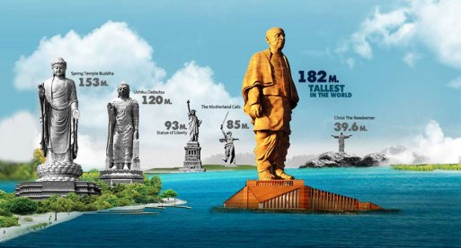

__Most of us oozed happiness in our pants when we finally saw the statue of unity being unveiled. Our ecstatic trip was further extended when an even taller Shivaji statue was announced. But now, we can handle no more, as our true Lord and saviour Modi Ji and Yogi Ji have announced an almost 200-metre tall statue of shree ram.__

However, with each solid move, there are negative opinions abound. So we have compiled a list of reasons, as to why our true lord and saviour Modi Ji and Yogi Ji have taken the right step, by announcing a big statue, again. 

### 1. EVERYBODY LOVE STATUES:

___Statue of liberty___ and ___Mansu Hill Grand Monument___ (N. Korea) are two world famous statues. Both are equally loved statues. People from around the world come to New York to see a grand beauty and almost everyone in North Korea is made to praise the statues of their supreme leaders. __From the far west to the far east, everybody loves statues.__ So if a method like that can work in North Korea, why can’t it work in India.

### 2. FUNDS FOR BUILDING PUBLIC INSTITUTIONS WILL BECOME LESS:

Now you must be thinking that the money could be spent on making hospitals, medical colleges and schools but all those will be government institutions. ___And what happens in government institutions? Corruption and nothing else.___ So it’s better to make a giant statue and let me tell you that ___only a communist would ask ‘how the maintaining of a statue will remain free of corruption?’.___

### 3. OUR LORD AND SAVIOUR WILL BE PLEASED

What else can be better than pleasing our Gods? Ahhhh! My soul is full of contentment and ecstasy just by the mere thought of it.

### 4. ASKING TOO MANY QUESTIONS IS COMMUNISM (#FORAFACT)

You see, not only the statue will attract several foreign tourists, but it is also a tool for finding out anti-national elements. It is even working very well. The day when the statue was announced, non-BJP supporters and non-BJP leaders, meaning anti-national entities, started raising their voice. We all know who these people are now and we will try to shield our precious culture from them. 

### 5. DOUBLE DHAMAKA (SPONSERED BY NAAPTOL)

After the ram mandir will be built, this statue will cement the dominance of our progressive culture, in the region. Because as usual, people who don’t follow our culture are clearly born low in IQ and should feel privileged to be at the feet of any Bhakt. So our lords will be pleased and simultaneously we shall establish our culture as the best culture in the world. 