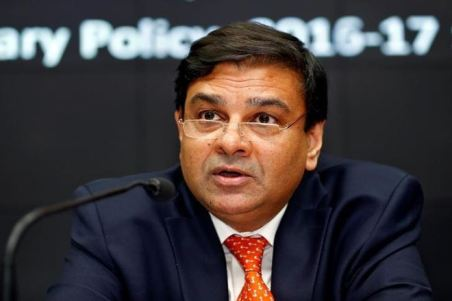

### HIGHLIGHTS:

> * The main reason behind his resignation was increasing tension between Finance Ministry and Central Bank.
> * Also there was clearly the interference of Government in the autonomy of RBI.
> * It was just a matter of time as this was already speculated by many.

Markets are closed right now, on this unfortunate day, but rather unsurprising news. However, we are soon going to see an impact of it tomorrow when the bell rings. The Rupee is expected to fall down and the financial markets are also set to take a dive due to today’s events. The RBI Governor Urjit Patel has resigned citing personal reasons. Although at this point, the entire country knows that it is due to the interference of Government in the autonomy of RBI. Forcing RBI to turn a blind eye for the release of funds for Medium and small-scale enterprises, which were largely political ambitions of the government, seems to be the main reason behind this resignation.

It all started when the RBI Deputy Governor warned the government about interfering with the working of RBI. He claimed that all those who don’t respect the autonomy of the central bank face the “wrath” of the markets. The statement made rounds on several news channels and was the hot topic for a few days. Arun Jaitley tried calming the whole situation down by stating that his and RBI’s Governer’s relations are rock solid. He insisted that any discrepancy will be sorted out with a mature discussion.

Thus a board meeting between the finance minister and the RBI was set up. The original claim of the government was that the RBI was sitting on too much capital and could afford to lend the government a few lakh crores. The RBI said that there was no extra cash and the bank cannot afford to give any more capital, following the huge pileup of Non-performing assets, especially by government banks over which the RBI has little to no control.

The facts back the RBI on this matter because the problem of a huge number of the non-performing asset is a very serious one. Ex-Governor Raghu Ram Rajan had also warned the government of the same but little to no impact was made.
The board meeting resulted in the RBI agreeing to allow the flow of capital for medium and small-scale enterprises, which were promised by the government. However, promises were kept on the resignation of RBI governor, it seems.

What happens now is unpredictable at best and catastrophic at worst. Amid the IL&FS scam, this is another shock and the markets will react very badly to it. Add to the whole situation the fact that, petrol companies are being forced to maintain fuel prices on a fixed point, in order to suit for the election season. The Economist had previously predicted that the next economic crisis will come from developing markets like Asia and the current inflation of Rupee along with a broken banking system can lead to some huge repercussions.