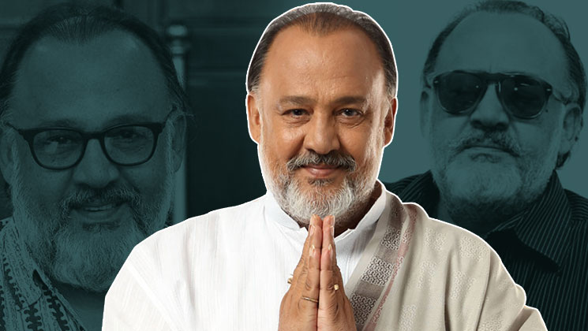

Memes are offensive to people at times. And edgy stuff like that has always been in controversy on social media and IRL in India. Being a dank meme page owner, I always get hate messages, threats and dick pics(and I don’t think it is because I’m cute). Religion, politicians, sportspersons, actors…, if you mock any of these, you are in trouble. It is like ___“how dare you ‘mock our small sensitive brains’ without our permission and don’t you know how much I like Salman Khan? so it is obvious that he is the greatest person on earth.”___ People are sucking dicks of the people they admire and forgetting the fact that they are mere humans and every human is a part of mockery. Not just that, humanity itself is a big sad joke. We are born cursed…..ehhh wait, this shit is getting dark for no reason! Nevertheless, you get my point.

On a serious note, <a href="https://www.livemint.com/Politics/sWTiTg8jscRZpKwSPN25UN/Prisoners-of-memes-social-media-victims.html" target="_blank">India is increasingly jailing its young for online posts that ‘offend’ politicians. The impact on their lives and families is devastating.</a>

We have to stop and think before going on a rant or taking a legal action against someone just because he/she posted a meme that offended you. 

#### HOW TO DIFFERENTIATE BETWEEN HATE SPEECH AND A MEME?

Indian constitution has <a href="https://en.wikipedia.org/wiki/Hate_speech_laws_in_India" target="_blank">some strict laws when it comes to hate speech</a>

_Section 295(A) of the Indian Penal Code (IPC) enacted in 1927 says:_

>>Whoever, with deliberate and malicious intention of outraging the religious feelings of any class of [citizens of India], [by words, either spoken or written, or by signs or by visible representations or otherwise], insults or attempts to insult the religion or the religious beliefs of that class, shall be punished with imprisonment of either description for a term which may extend to [three years], or with fine, or with both.

If you read the above text carefully, you will notice the word “intention”. That’s a major difference between hate speech/propaganda against your favourite person and a harmless meme, which is clearly not intended to defame him/her. Then there are memes that are made to call out someone’s stupidity or hypocrisy in an exaggerated way. But again that’s what exactly a meme is- an ___"exaggerated form of humour"___. You should not take things as such ‘said in a meme’. Memes nitpick things out of context to make them look funny and/or obscure at times.  If you think memes to be some sort of news or a fact then you are at fault and not the memer. 

Bottom line is- memes are not intentional. You should not insinuate things and label someone as “anti-something” just because the person in concern finds something funny and you don’t. Maybe the meme never was offensive inherently and you just interpreted it in a wrong way. And it is okay to take offence but that doesn’t give you a right to shut down someone’s opinion.

Now be sanskaari and share the article with your friends.

– Ashutosh Dubey